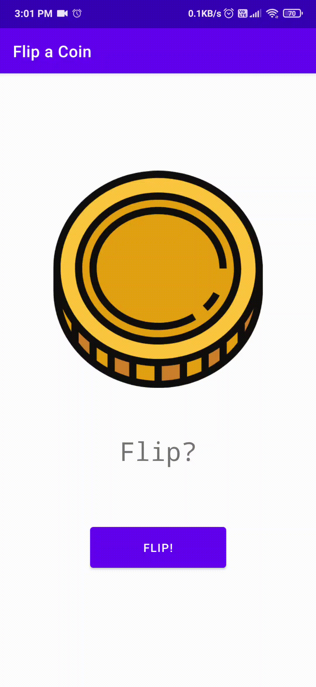

## Flip-a-Coin
---  

	

A basic Android application which lets user touch a button to output a random event of either Heads or Tails.  

### Screenshots

---

  
  

### Download

---

Click [here](https://drive.google.com/file/d/1Ve9vDXy7GCqx9hgdvRiHejxQBg9kG206/view?usp=sharing) to download the apk file.  

